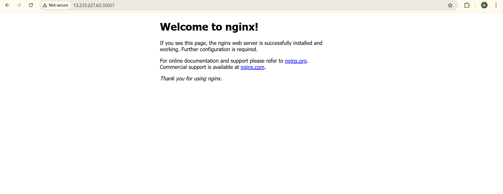

## Q1. What is the smallest unit that Kubernetes deploys?
- A. Node
- B. Pod
- C. Service
- D. Container

### --> B. Pod     

## Q2. Which Kubernetes object is used to expose pods to network traffic?
- A. Pod
- B. Deployment
- C. Service
- D. Namespace

### --> C. Service

## Q3. Which Service type is used only for internal communication inside the cluster?
- A. NodePort
- B. LoadBalancer
- C. ClusterIP
- D. ExternalName

### --> C. ClusterIP

## Q4. You want to access an application using `<NodeIP>:<Port>`.
Which Service type should you use?
- A. ClusterIP
- B. NodePort
- C. LoadBalancer
- D. Headless

### --> B. NodePort

## Q5. Which Service type is mainly used in cloud environments to expose applications externally?
- A. ClusterIP
- B. NodePort
- C. LoadBalancer
- D. ExternalName

 ### --> C. LoadBalancer

## Q6. A pod is deleted accidentally. Which pod type can automatically recreate it?
- A. Standalone Pod
- B. Static Pod
- C. Pod managed by Deployment
- D. Init Pod

### --> C. Pod managed by Deployment

## Q7. Which pod type is used to run initialization tasks before the main container starts?
- A. Sidecar Pod
- B. Init Pod
- C. Static Pod
- D. Multi-container Pod

### --> B. Init Pod

## Q8. Containers inside the same pod communicate using:
- A. Different IP addresses
- B. Service only
- C. Same IP address
- D. External LoadBalancer

### --> C. Same IP address

## Q9. Which Service assigns a stable internal IP address automatically?
- A. NodePort
- B. LoadBalancer
- C. ClusterIP
- D. ExternalName

### --> C. ClusterIP

## Q10. You created a Service, but traffic is not reaching the pod.
What is the most common reason?
- A. Wrong image
- B. Label mismatch
- C. Pod crash
- D. Node failure

### --> B. Label mismatch

## Q11. Which Kubernetes component provides DNS-based service discovery?
- A. kubelet
- B. kube-proxy
- C. CoreDNS
- D. Scheduler

### --> C. CoreDNS

## Q12. You want a pod to always run on a specific node.
Which pod type is used?
- A. Init Pod
- B. Sidecar Pod
- C. Static Pod
- D. Ephemeral Pod

### --> C. Static Pod

## Q13. Which Service type exposes a fixed port on every node?
- A. ClusterIP
- B. NodePort
- C. LoadBalancer
- D. ExternalName

### --> B. NodePort

## Q14. You want pods inside the cluster to access an application using a DNS name.
Which Service type should you use?
- A. NodePort
- B. LoadBalancer
- C. ClusterIP
- D. ExternalName

### --> C. ClusterIP

## Q15. Which command shows the IP address of a pod?
- A. kubectl get nodes
- B. kubectl logs pod
- C. kubectl get pods -o wide
- D. kubectl describe service

### --> C. kubectl get pods -o wide

## Q16. You created a LoadBalancer Service in a local cluster.
What usually happens?
- A. External IP is assigned immediately
- B. External IP stays pending
- C. Pod is deleted
- D. Service creation fails

### -->  B. External IP stays pending

## Q17. Which pod type is commonly used to support a main application with logging or monitoring?
- A. Init Pod
- B. Standalone Pod
- C. Sidecar Pod
- D. Static Pod

### --> C. Sidecar Pod

## Q18. Which Service field decides which pods receive traffic?
- A. ports
- B. type
- C. selector
- D. metadata

### --> C. selector

## Q19. Which command is used to list all Services in a namespace?
- A. kubectl get pods
- B. kubectl get svc
- C. kubectl describe pod
- D. kubectl logs svc

### --> B. kubectl get svc

## Q20. Two pods in the same namespace want to communicate.
What is the recommended Kubernetes way?
- A. Use pod IP directly
- B. Use Service name
- C. Use node IP
- D. Use external IP

### --> B. Use Service name

# Kubernetes Practical Assignment :

## Deployment Details :
 - **Deployment Name:** web-app-deployment
- **Number of Replicas:** 2

## Service Details :
- **Service Name:** web-app-service
- **Service Type:** NodePort

## Application Access
- **URL:** http://13.233.227.63:30007

## Screenshot :

### Submitted by :
## Name: **- Aditya Kadam**

